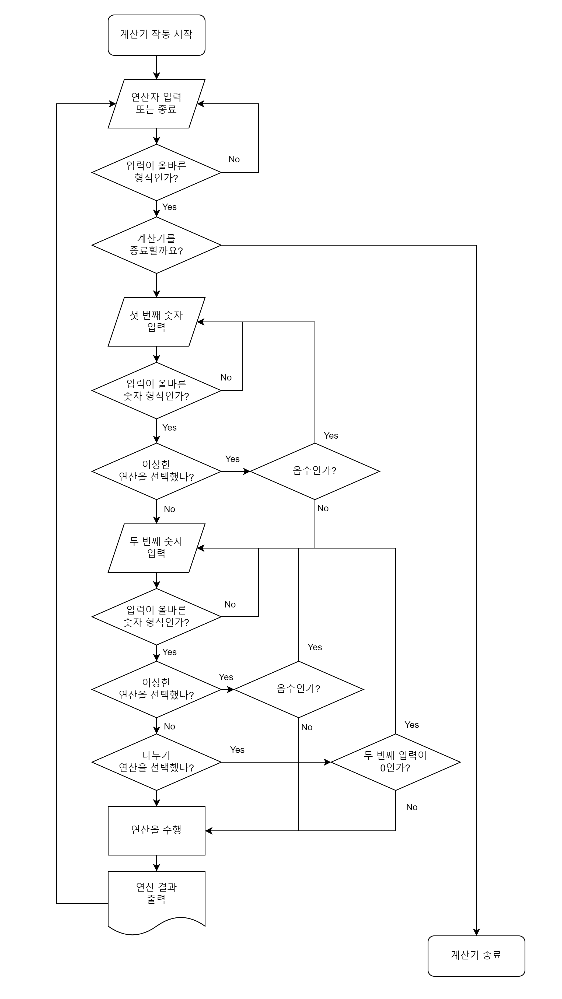

# :computer: 계산기

<strong>간단한 계산을 할 수 있는 계산기입니다.</strong>

코틀린 기본 문법을 공부한 뒤 응용해서 만들어 본 과제입니다.

 

## :scroll: 계산기 작동 순서도

 

## :books: 프로젝트 필수 구현 사항

#### 필수 구현 기능

- Lv1
    - 더하기, 빼기, 나누기, 곱하기 연산을 수행할 수 있는 Calculator 클래스를 만들기
    - 생성한 클래스를 이용하여 연산을 진행하고 출력하기

- Lv2
    - Lv1에서 만든 Calculator 클래스에 “나머지 연산”이 가능하도록 코드를 추가하고, 연산 진행 후 출력
    - ex) 나머지 연산 예시 : 6을 3으로 나눈 나머지는 0 / 5를 3으로 나눈 나머지는 2

- Lv3
    - 아래 각각 클래스들을 만들고 클래스간의 관계를 고려하여 Calculator 클래스와 관계 맺기
        - AddOperation(더하기)
        - SubstractOperation(빼기)
        - MultiplyOperation(곱하기)
        - DivideOperation(나누기)
        - 관계를 맺은 후 필요하다면 Calculator 클래스의 내부코드를 변경
    - `HINT` : 매개변수로 클래스를 주고 받아 객체를 주입하는 것이 핵심!
     
#### 선택 구현 기능

- Lv4
    - 아래 연산 클래스들을 AbstractOperation라는 클래스명으로 만들어 사용하여 추상 클래스로 정의하고 Calculator 클래스의 내부 코드를 변경합니다.
        - AddOperation(더하기)
        - SubtractOperation(빼기)
        - MultiplyOperation(곱하기)
        - DivideOperation(나누기)
    - `HINT` : ‘상속’이라는 키워드로 찾아봅시다!

 

## :clipboard: 프로젝트 필수 구현사항에 따라 제작한 계산기 세부사항
- AbstractOperation이라는 추상 클래스를 정의하고 이 추상 클래스를 상속받아 더하기, 빼기, 곱하기, 몫 구하기, 나머지 구하기 연산 클래스들을 만들어 함수를 구현하였습니다.
- Calculator는 위 추상 클래스를 구현한 클래스들과 숫자들을 매개변수로 받아 연산한 뒤 결과를 반환합니다.

 

## :beer: 개인적으로 추가해본 계산기 기능들
- Int 범위 내($-2,147,483,648$ ~ $2,147,483,647$)의 정수 값만 입력으로 받습니다.
    - 숫자가 정수값을 벗어나거나, 숫자가 아닌 문자열을 입력하는 경우 오류 메시지와 함께 입력을 다시 받습니다.
    - 정규표현식을 활용하여 앞에 0이 붙는 숫자 문자열의 입력도 불가능하도록 만들었습니다.
    - 입력불가 예시: $01$, $0000005$, $002482043$, $-00000004$, $-0$
- 출력 타입은 Long입니다
    - Int 범위 내의 두 정수로만 입력을 받았기 때문에 오버플로우가 발생하지 않습니다.
- 더하기, 빼기, 곱하기, 몫 구하기, 나머지 구하기 연산 이외에 이상한 더하기 기능을 추가하였습니다.
    - 이상한 더하기 연산을 선택하면 암산왕이 호출되어 이상한 더하기 계산을 해줍니다.
    - 암산왕은 숫자를 그냥 이어붙여 더해줍니다.
    - 예시: $192$와 $8293$를 입력하면 $1928293$을 출력해줍니다.
    - 암산왕은 음수의 개념을 모르기때문에 음수를 입력하면 다시 숫자를 입력해달라고 요청합니다.
    - 자리숫자가 너무 많은 두 수를 입력하면 암산왕이 암산에 실패하며 "아휴 뭐 이리 길어요 (@^_^)=@"라고 투정을 부립니다.
- 계산기를 종료하기 전까지 두 수를 입력한 뒤 반복해서 연산이 가능합니다.

 

## :pushpin: 환경설정
- Language: Kotlin
- IDE: Intellij
- SDK: Eclipse Temurin 18.0.2

