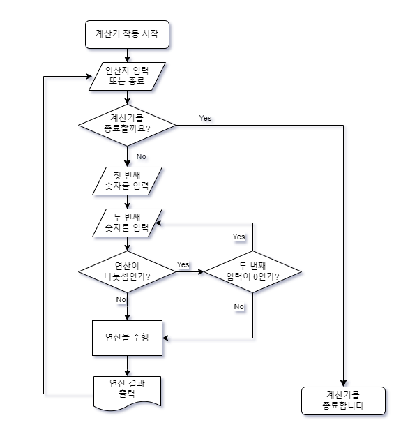

# 계산기

간단한 계산을 할 수 있는 계산기입니다.

### 계산기 작동 순서도

### 계산기 세부사항
- Int 범위 내($-2,147,483,648$ ~ $2,147,483,647$)의 정수 값만 입력으로 받습니다.
- 더하기, 빼기, 곱하기, 몫 구하기, 나머지 구하기 5 가지 연산이 가능합니다.
- 계산기를 종료하기 전까지 반복해서 연산이 가능합니다.
- 출력 타입은 Long입니다.
